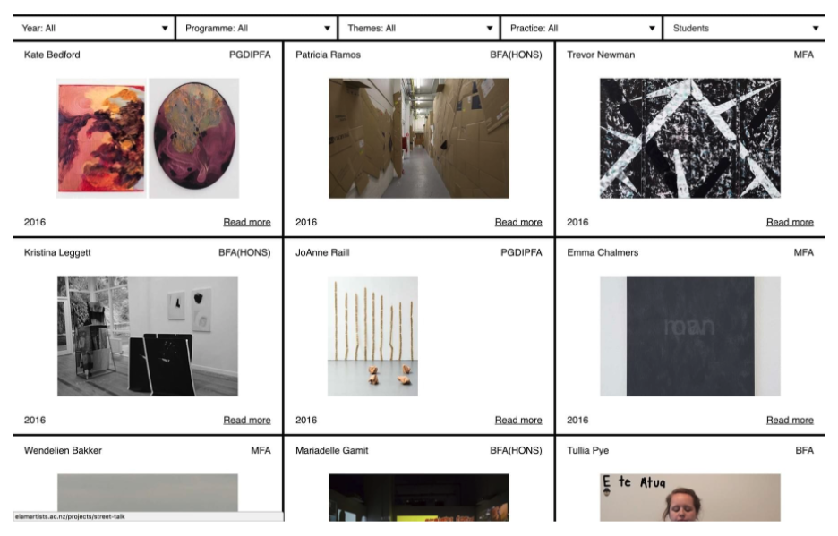
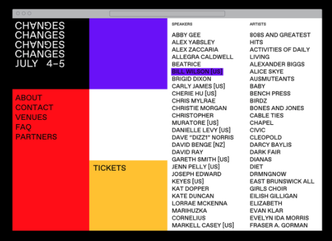

### Practice8. Event schedule sheet.

연습사항

- 화면의 기본 배치는 Grid와 Flex의 속성을 이용해서 배치하도록 한다.
- grid-row와 grid-column의 속성을 적절히 사용하여 화면의 배치를 한다.
- div 태그를 사용하기전에 기본 HTML5 Semantic Tags를 사용한다.

### Practice7. Art gallery works.

연습사항

- 화면의 기본 배치는 Grid와 Flex의 속성을 이용해서 배치하도록 한다.
- grid-row와 grid-column의 속성을 적절히 사용하여 화면의 배치를 한다.
- div 태그를 사용하기전에 기본 HTML5 Semantic Tags를 사용한다.

### Practice6. Structured picture frame.

연습사항

- 화면의 기본 배치는 Grid의 속성을 이용해서 배치하도록 한다.
- grid-row와 grid-column의 속성을 적절히 사용하여 화면의 배치를 한다.

### Practice5. Structured simple boxes

연습사항

- 화면의 박스요소들을 배치할때, Grid의 속성을 이용해서 배치하도록 한다.
- grid-row와 grid-column의 속성을 적절히 사용하여 화면의 배치를 한다.

### Practice4. minmax and auto-fill&auto-fit

연습사항

- 화면의 박스요소들을 배치할때, Grid의 속성을 이용해서 배치하도록 한다.
- minmax와 auto-fill 또는 auto-fit을 활용하여 화면에 있는 box들을 배치한다.

### Practice3. Structured simple boxes

연습사항

- 화면의 박스요소들을 배치할때, Grid속성만을 이용해서 배치하도록 한다.
- grid의 justify-items, align-items의 속성을 이해하고 활용한다.

### Practice2. Simple poster2

연습사항

- 화면의 요소들을 배치할때, Grid의 속성을 이용해서 배치하도록 한다.
- grid-row과 grid-column을 사용하여 각 행과 열의 시작과 끝을 지정한다.
- grid-template-columns와 grid-template-rows의 속성을 알고 사용한다.

### Practice1. Simple poster1

연습사항

- 화면의 요소들을 배치할때, flexbox의 속성을 이용해서 배치하도록 한다.
- div 태그를 사용하기전에 기본 HTML5 Semantic Tags를 사용한다.
- class이름을 작성할때, BEM(Block Element Modifier)의 기준에 맞게 작성을 한다.

